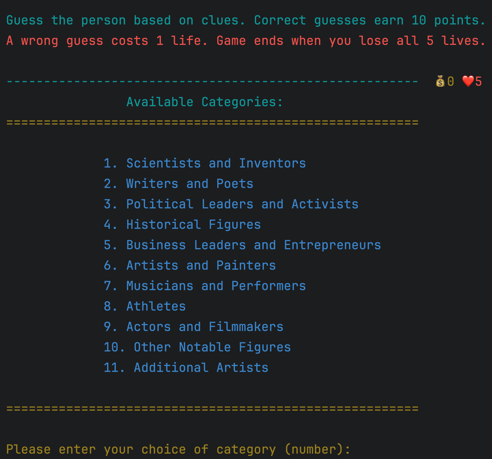
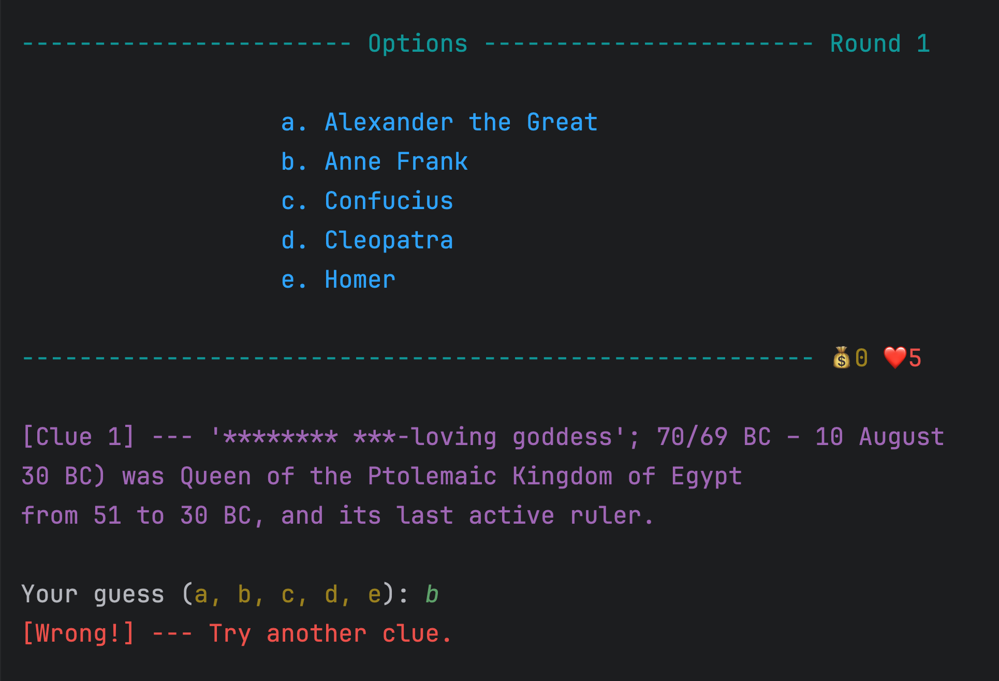
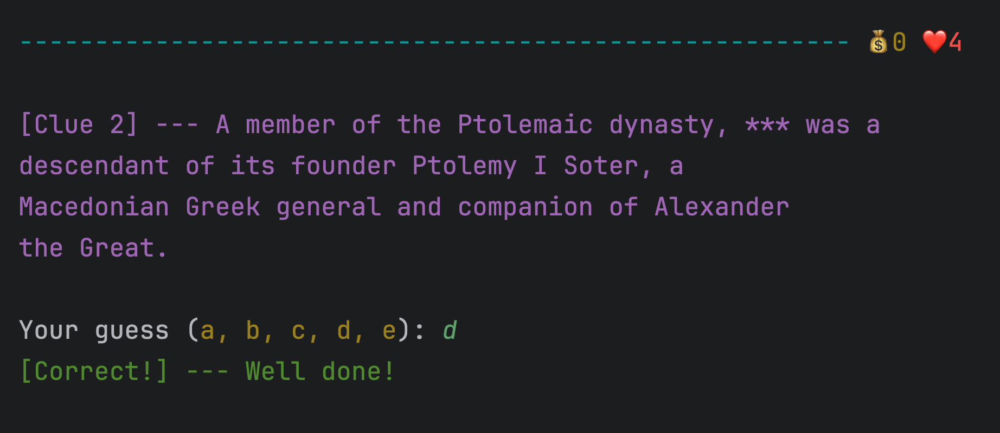

# wikiWho? - A Python Game Using Wikipedia Data

**wikiWho?** is a fun and educational Python-based guessing game. Players attempt to identify famous individuals based on dynamically fetched clues from Wikipedia summaries. The game includes scoring, a lives system, sanitized clues, and multiple rounds.


## 🎮 Game Features

- **Objective**: Guess a famous person using sanitized clues derived from Wikipedia.
- **Dynamic Gameplay**: Fetches real-time summaries to generate clues for players.
- **Lives System**: Players start with 5 lives; each incorrect guess deducts a life.
- **Scoring**: Correct answers earn points, while wrong guesses cost lives.
- **Rounds**: Continue playing until you lose all lives.
- **Replay Option**: Restart the game upon completion.


## Available Categories




## 🕹️ Gameplay

1. Players are presented with clues about a famous person (excluding the name).
2. Choose the correct person from five options: A, B, C, D, or E.
3. Accumulate points for correct guesses.
4. The game ends when all lives are lost.


  


 


## 📚 Scoring and Lives

- **Points**: Earn 10 points for each correct answer.
- **Lives**: Lose 1 life for every incorrect guess. Game ends at 0 lives.

## 🛠️ Setup

### Prerequisites

Ensure you have Python 3 installed on your machine.


## 🙌 Contributions and Thanks  

### Team Members:

- **Abigail Conteh** 
- **Grettch**
- **Juliana Trombetta**  
- **Preethi Sivakumar**
- **Nikola Brajkovic**  

### Mentor:  

- **Maicon de Morais**: Guidance, Code Review, and Support  


### Special Thanks  

This project was developed as part of **MasterSchool's First Hackathon** for our class. We are grateful for the opportunity and support from our mentors and peers, which helped bring this game to life.


### Enjoy playing wikiWho? and test your knowledge of famous personalities! 🎉

# wikiWho? - Setup Guide

## Prerequisites

Ensure you have Python 3 installed on your system.

## Installation Steps

1. **Clone the Repository**
   Clone the game repository from GitHub:
   ```
   git clone https://github.com/Viktor0317/wikiWho-Python-Game.git
   cd wikiWho
   ```

2. **Install Required Modules**
   Install the dependencies listed below using pip/pip3:
  

3. **Run the Game**
   Start the game by executing the main script:
   ```
   python3 wikiWho.py
   ```

## Dependencies

- `wikipedia`: Used for fetching clues from Wikipedia.
- `colorama`: For colored output in the terminal.

### Sample Commands to Install
```
pip3 install wikipedia
pip3 install colorama
```

Enjoy playing **wikiWho?** and have fun guessing!

